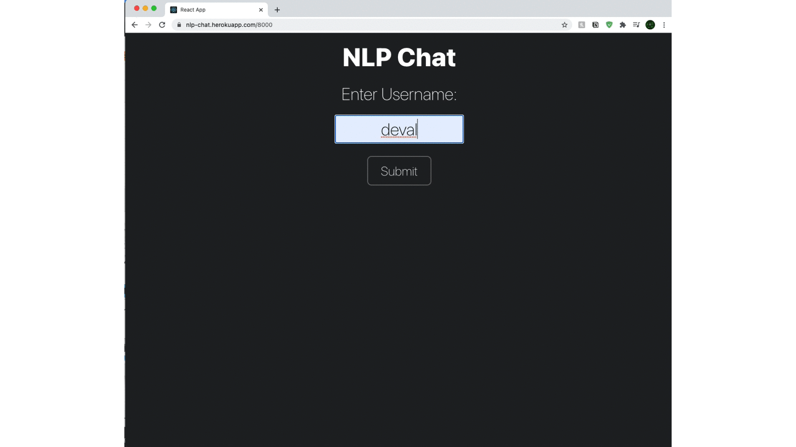

# AI-Powered NLP Chat Application

A real-time chat application with AI assistant, natural language processing, sentiment analysis, and persistent storage.



## 🌟 Features

### 💬 AI Chatbot
- **Intelligent Responses**: AI Assistant powered by OpenRouter's GPT-OSS-20B model
- **Context-Aware**: Remembers conversation history for coherent responses
- **Natural Language**: Human-like conversations with reduced hallucinations
- **Real-time**: Instant responses in the chat interface

### 🧠 Natural Language Processing
- **Tone Analysis**: Detects emotional tone (Joy, Sadness, Anger, Fear, Confident, Tentative, Analytical, Neutral)
- **Sentiment Tracking**: Real-time sentiment analysis using TensorFlow.js CNN model
- **Context-Aware Analysis**: Uses conversation history for accurate detection
- **Smart Caching**: Instant results for repeated messages

### 💾 Persistent Storage
- **SQLite Database**: All data saved to disk
- **Chat History**: Complete conversation logs preserved
- **User Tracking**: User accounts and activity monitoring
- **Sentiment Analytics**: Historical sentiment data
- **Session Management**: Automatic cleanup of old sessions

### 🔄 Real-time Communication
- **WebSocket**: Instant message delivery via Socket.IO
- **Multi-user**: Support for multiple concurrent users
- **Live Updates**: Real-time tone and sentiment updates
- **User Presence**: See who's online

## 🏗️ Architecture

```
┌─────────────────────────────────────────────────────────────┐
│                     Frontend (React)                        │
│  ┌──────────────┐  ┌──────────────┐  ┌──────────────┐     │
│  │   Chat UI    │  │  User List   │  │  Sentiment   │     │
│  └──────────────┘  └──────────────┘  └──────────────┘     │
└────────────────────────┬────────────────────────────────────┘
                         │ Socket.IO (WebSocket)
┌────────────────────────┴────────────────────────────────────┐
│                  Backend (Node.js + Express)                │
│  ┌──────────────┐  ┌──────────────┐  ┌──────────────┐     │
│  │   Socket.IO  │  │  Session Mgr │  │  API Routes  │     │
│  └──────────────┘  └──────────────┘  └──────────────┘     │
└─────────┬──────────────────┬──────────────────┬────────────┘
          │                  │                  │
    ┌─────▼─────┐      ┌────▼────┐       ┌────▼────┐
    │ OpenRouter│      │TensorFlow│       │ SQLite  │
    │    API    │      │   .js    │       │   DB    │
    │(GPT Model)│      │(Sentiment)│      │(Storage)│
    └───────────┘      └──────────┘       └─────────┘
```

## 🛠️ Technology Stack

### Backend
- **Node.js** - Runtime environment
- **Express** - Web framework
- **Socket.IO** - Real-time WebSocket communication
- **SQLite** (better-sqlite3) - Persistent database
- **TensorFlow.js** - Sentiment analysis
- **OpenRouter API** - AI chat responses

### Frontend
- **React** - UI framework
- **TypeScript** - Type safety
- **Bootstrap** - UI components
- **Socket.IO Client** - Real-time communication

## 📦 Installation

### Prerequisites
- Node.js (v14 or higher)
- npm or yarn

### Setup

1. **Clone the repository**
```bash
git clone <repository-url>
cd NLPChatApp-main
```

2. **Install root dependencies**
```bash
npm install
```

3. **Install backend dependencies**
```bash
cd backend
npm install
```

4. **Install frontend dependencies**
```bash
cd ../nlp-chat-client
npm install
```

5. **Configure environment variables**

Create `backend/.env` file:
```env
OPENROUTER_API_KEY=your_openrouter_api_key_here
PORT=8000
```

Get your free OpenRouter API key at: https://openrouter.ai/

## 🚀 Running the Application

### Development Mode (Recommended)

From the root directory:
```bash
npm run dev
```

This starts both backend and frontend concurrently:
- Backend: http://localhost:8000
- Frontend: http://localhost:3000

### Production Mode

1. Build the frontend:
```bash
cd nlp-chat-client
npm run build
```

2. Start the backend:
```bash
cd ../backend
npm start
```

Access at: http://localhost:8000

## 📊 Database

### View Database Contents

```bash
cd backend
node view-db.js
```

This displays:
- Recent users
- Active sessions
- Latest messages
- Sentiment history
- Statistics

### Database Schema

**Users Table**
- User information and socket connections
- Last activity tracking

**Sessions Table**
- Chat sessions with timestamps
- Links to users

**Messages Table**
- All chat messages (user + AI)
- Tone analysis results
- Sentiment scores

**Sentiment History Table**
- Sentiment changes over time
- Average sentiment per session

### Manual Database Access

Using SQLite CLI:
```bash
cd backend
sqlite3 chat.db

-- View tables
.tables

-- Query messages
SELECT * FROM messages ORDER BY timestamp DESC LIMIT 10;

-- Exit
.quit
```

## 🎯 Usage

1. **Open the app** at http://localhost:3000
2. **Enter your username** to join the chat
3. **Send a message** - The AI Assistant will respond
4. **View tone analysis** - Each message shows its emotional tone
5. **Track sentiment** - Overall conversation mood displayed in real-time

### Example Conversation

```
You: Hello!
AI Assistant: Hello! How can I help you today?

You: I'm learning about NLP
AI Assistant: That's great! Natural Language Processing is fascinating...

You: Can you explain sentiment analysis?
AI Assistant: Sentiment analysis is a technique that determines...
```

## 🔧 Configuration

### Adjust AI Behavior

Edit `backend/server.js`:

```javascript
// Change temperature (0.0 = focused, 1.0 = creative)
temperature: 0.5

// Change response length
max_tokens: 400

// Modify system prompt
content: 'You are a helpful AI assistant...'
```

### Session Settings

```javascript
// Memory per session (messages)
const MAX_MEMORY_MESSAGES = 10;

// Cache size (tone analysis)
const MAX_CACHE_SIZE = 100;

// Session cleanup interval
setInterval(() => { ... }, 5 * 60 * 1000); // 5 minutes
```

## 📁 Project Structure

```
NLPChatApp-main/
├── backend/
│   ├── server.js           # Main server file
│   ├── database.js         # SQLite database operations
│   ├── view-db.js          # Database viewer script
│   ├── chat.db             # SQLite database file
│   ├── .env                # Environment variables
│   └── package.json        # Backend dependencies
├── nlp-chat-client/
│   ├── src/
│   │   ├── components/
│   │   │   └── chat/       # Chat components
│   │   ├── App.tsx         # Main app component
│   │   └── index.tsx       # Entry point
│   ├── public/             # Static assets
│   └── package.json        # Frontend dependencies
├── package.json            # Root package (dev scripts)
├── README.md               # This file
└── MEMORY_FEATURES.md      # Detailed feature documentation
```

## 🧪 Testing

### Test AI Chat Response
```bash
cd backend
node test-ai-chat.js
```

### Test OpenRouter API
```bash
cd backend
node test-openrouter.js
```

## 🐛 Troubleshooting

### WebSocket Connection Failed
- Ensure backend is running on port 8000
- Check firewall settings
- Verify CORS configuration

### Database Errors
- Delete `backend/chat.db` and restart
- Check file permissions
- Ensure SQLite is properly installed

### AI Not Responding
- Verify OpenRouter API key in `.env`
- Check API quota at https://openrouter.ai/
- Review backend logs for errors

### Frontend Not Loading
- Clear browser cache
- Check console for errors
- Ensure port 3000 is available

## 📈 Performance

- **Response Time**: < 2 seconds for AI responses
- **Sentiment Analysis**: Real-time (< 100ms)
- **Tone Detection**: Cached results instant
- **Database**: Optimized with indexes
- **Concurrent Users**: Supports 100+ simultaneous connections

## 🔒 Security

- API keys stored in `.env` (not committed)
- Input sanitization for SQL injection prevention
- CORS configured for localhost
- Session cleanup prevents memory leaks
- No sensitive data logged

## 🚧 Future Enhancements

- [ ] User authentication and login
- [ ] Private messaging between users
- [ ] File sharing and image support
- [ ] Voice messages
- [ ] Multi-language support
- [ ] Export chat history
- [ ] Custom AI personalities
- [ ] Mobile app (React Native)

## 📝 License

ISC License

## 👥 Author

Deval Parikh

## 🙏 Acknowledgments

- OpenRouter for AI API access
- TensorFlow.js for sentiment analysis
- Google for pre-trained sentiment model
- Socket.IO for real-time communication

## 📞 Support

For issues and questions:
- Open an issue on GitHub
- Check existing documentation
- Review troubleshooting section

---

**Built with ❤️ using Node.js, React, and AI**
